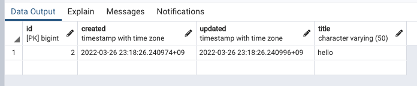

# 환경설정 (Backend)

* `requirements.txt` 혹은 `Pipfile`로 환경을 갖추면 됨.
* 패키지 설치할때마다 Git Push 전에 `requirements.txt` 갱신하기
  * `pip freeze > requirements.txt`
    * or `pipenv run pip freeze > requirements.txt`
  * `Pipfile`은 `pipenv`를 사용한다면 자동으로 갱신됨

## PostgreSQL

* DB Name: `dayplan.it`
* pgAdmin등으로 DB 생성하고 /config/에 .env로 환경변수 추가해주기
* DB에 postgis extension 설치

## 강추하는 VSC Extension
* Prettier: 코드 포매터, 저장 누를때마다 알아서 코드를 이쁘게 보이게 정리해줌. 실수로 보이는 코드는 수정까지 해줌.
* Formatting Toggle: 코드 포매터를 끄고싶을 때 끌 수 있도록 Toggle을 추가해줌.
* Material Icon Theme: VSC에서 이쁜 아이콘
  * {:style="display:block; margin:auto;" width="70%"}
  이렇게 파일 뿐만 아니라 폴더도 폴더 이름 보고 알아서 이쁜 아이콘을 붙여줌
* WakaTime: 내가 어떤 언어를 얼마나 코딩했는지 통계내줌
  * {:style="display:block; margin:auto;" width="70%"}
  이런식으로 통계내주는데 보고 있으면 재밌는듯. VSC 말고 다른 IDE에서도(이클립스 포함) 사용 가능해서 통계를 전체적으로 내줌

# Django Docs

문제가 생기면 [Django Docs](https://docs.djangoproject.com/en/4.0/) 참고하기

# Applications

* users: 유저
* tastes: 취향
* schedules
* routes
* core: abstract model(TimeStampedModel), created / updated field
    * schedules, routes 등 생성 및 수정시각 저장이 필요한 경우 사용
    * 예를 들어,
    ~~~python
    from django.db import models
    from core import models as core_models

    class Schedule(core_models.TimeStampedModel):

        """ Schedule Model Definition """

        title = models.CharField(max_length=50)

        def __str__(self):
            return self.title
    ~~~
    이런 식으로 Schedule이라는 모델을 만들면
    {:style="display:block; margin:auto;" width="70%"}
    이런 식으로 저장이 됨

## Guidelines
* 가능하다면 `admin.py` 작성
* `models.py`에서 굳이 한 클래스에 모든걸 다 넣으려고 하지 말고, 필요하다면 여러 클래스로 나눌것. (한 클래스 = 한 테이블)
* `ForeignKey` 삭제 옵션은 `CASCADE`로
* 개발할 때 사용할 로컬 DB 관리 대책이 필요할듯. Migrations 폴더 내의 파일은 .gitignore에 추가할지?
* 항상 `main` branch는 남기고, 본인이 개발할 내용을 담은 branch를 새로 만들어 작업 후 `PR`을 남기도록 하기
    * reviewer가 한 명 이상이여야 merge되도록 git 설정할 예정
    * 가능하다면 최소한 commit명이라도 영어로 남기기!

